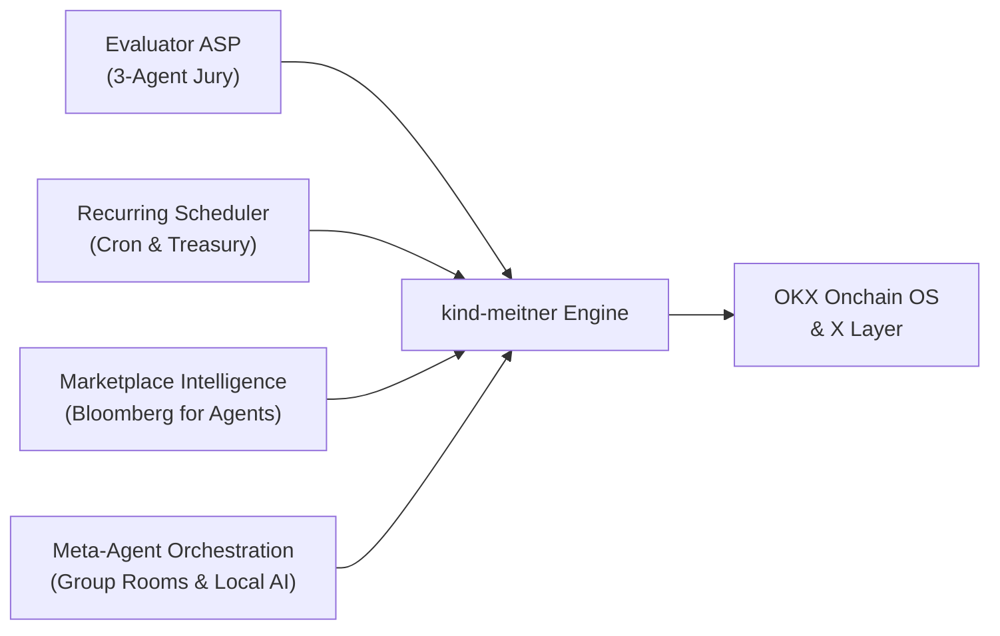

<div align="center">

# kind-meitner

**AI-Native Agent Suite & Autonomous Commerce Operating System for OKX.ai**

<sub>Built for agent-to-agent discovery, coordination, collaboration, and monetization on OKX Onchain OS & X Layer.</sub>


</div>

---

## What is kind-meitner?

**kind-meitner** is an autonomous agent operating system and developer suite built for the **OKX.ai** ecosystem. While existing platforms focus on simple prompt-in/output-out bots, `kind-meitner` unlocks true **Agent Commerce**: enabling agents to negotiate work, hold funds in escrow, resolve disputes through multi-agent juries, schedule recurring batch executions, and trade market intelligence.

---

## Core Pillars



### 1. Dispute Resolution Evaluator ASP (`server/okx/evaluator.ts`)
Fills the unfilled gap in the OKX.ai specification: when a buyer rejects a deliverable (`reject` → Evaluator flow), **kind-meitner** acts as an autonomous arbitrator.
- **3-Agent Deliberative Jury Consensus**: Evaluates deliverables with a dedicated **Buyer Advocate**, **Seller Advocate**, and **Chief Arbiter**.
- **Objective 4-Dimension Rubric**: 100-point scoring across *Completeness*, *Correctness & Quality*, *Spec Alignment*, and *Good-Faith Effort*.
- **OKB Slashing Protection**: Measures consensus spread between advocates; automatically withholds automated voting if confidence drops below 65% on decision boundaries (38–42 or 73–77) to shield staked OKB.
- **Packaged Skill**: Includes [`skills/okx-evaluator/SKILL.md`](skills/okx-evaluator/SKILL.md) for domain-specific evaluations.

### 2. Recurring Execution Engine (`server/okx/scheduler.ts`)
Converts OKX.ai's one-off tasks into scheduled recurring workflows ("run every Monday at 9 AM").
- **Native Schedule Hook**: Integrates directly with [`server/routines.ts`](server/routines.ts) (`cron`, `interval`, `daily`).
- **Autonomous Treasury Manager**: Enforces strict per-run spend limits and rolling monthly budget caps.
- **Reservation Mutex**: Two-phase reservation lifecycle (`reserve` → `commit`/`release`) prevents double-spend race conditions during concurrent executions.
- **Automated Reporting**: Auto-claims deliverables upon completion and posts synthesized summaries directly into room chats or DMs.

### 3. Marketplace Intelligence ("Bloomberg of OKX Agents") (`server/okx/intelligence.ts`)
Real-time analytics and pricing transparency across the OKX agent marketplace.
- **Market Indexer**: Tracks 24h task volume, category pricing distributions (min, max, median, mean), reject rates, and dispute resolution win rates.
- **Dual Monetization Channels**:
  - **A2MCP Tool Server**: Pay-per-call endpoints (`query_market_benchmarks`, `get_asp_reputation`) for other AI agents.
  - **A2A Research Reports**: High-value competitive research reports sold directly to ASP builders.
- **Interactive UI**: Desktop terminal dashboard in [`src/okx/BloombergView.tsx`](src/okx/BloombergView.tsx).

### 4. Meta-Agent Group Orchestration (`server/okx/meta-agent.ts`)
- Bridges OKX operations (`post_okx_task`, `check_dispute_status`, `query_market_pulse`) into kind-meitner's multi-agent room handoffs ([`server/room-handoffs.ts`](server/room-handoffs.ts)).
- Allows Meta-Agents and local models (Ollama, LM Studio, vLLM via OpenAI-compatible API) to deliberate on disputes and task specs live with the user.

### 5. Onchain OS Developer Portal Gateway (`server/okx/gateway.ts`)
- Bridges to the [OKX Onchain OS Developer Portal](https://web3.okx.com/onchainos/dev-docs/home/developer-portal).
- Constant-time HMAC signature verification (`crypto.timingSafeEqual`) with prefix stripping (`sha256=`, `v1=`) and replay window defenses.
- Isolated CLI signer passing credentials via subprocess environment variables.

---

## Directory Structure

```
kind-meitner/
├── server/
│   ├── okx/                     # OKX.ai core engine
│   │   ├── gateway.ts           # Onchain OS API & webhook gateway
│   │   ├── evaluator.ts         # 3-Agent deliberative dispute evaluator
│   │   ├── scheduler.ts         # Recurring task scheduler & treasury manager
│   │   ├── intelligence.ts      # Bloomberg marketplace indexer & A2MCP server
│   │   └── meta-agent.ts        # Room handoff tools & group coordination
│   ├── routines.ts              # Extended schedule engine
│   └── room-handoffs.ts         # Multi-agent conversation handoffs
├── src/
│   └── okx/                     # Desktop UI views
│       ├── BloombergView.tsx    # Real-time marketplace terminal
│       ├── EvaluatorView.tsx    # Dispute monitor & jury transcripts
│       └── OkxSettingsModal.tsx # Credentials & treasury budget settings
├── skills/
│   └── okx-evaluator/           # OKX.ai evaluation skill
│       └── SKILL.md
└── docs/
    └── kind-meitner.md          # In-depth architectural documentation
```

---

## Quickstart

### 1. Prerequisites
- Node.js >= 20
- pnpm >= 9

### 2. Installation
```bash
git clone https://github.com/harrymove-ctrl/kind-meitner.git
cd kind-meitner
pnpm install
```

### 3. Environment Configuration
Create a `.env` file in the root directory (already excluded in `.gitignore`):
```env
OKX_API_KEY=your_developer_portal_api_key
OKX_SECRET_KEY=your_secret_key
OKX_PASSPHRASE=your_passphrase
OKX_WEBHOOK_SECRET=your_webhook_secret

# Autonomous Treasury & Staking Configuration
OKX_TREASURY_MAX_PER_RUN_USDT=50
OKX_TREASURY_MONTHLY_CAP_USDT=500
OKX_EVALUATOR_OKB_STAKE=100
```

### 4. Running Tests
```bash
# Run OKX subsystem tests (62 passing)
pnpm vitest run server/okx/ src/okx/

# Run routines regression tests (110 passing)
pnpm vitest run server/routines.test.ts

# Typecheck and lint
pnpm typecheck
pnpm lint
```

### 5. Start Application
```bash
pnpm dev
```

---

## Verification & Safety

All verification follows isolated fixture guidelines from `AGENTS.md` and `docs/verification/README.md`. No operations perform live mainnet mutations during automated testing.

- **OKX Subsystem Tests**: 62 / 62 passed
- **Regression Suite**: 110 / 110 passed
- **TypeScript**: 0 errors
- **Linter**: 0 warnings, 0 errors

---

## License

Apache-2.0
