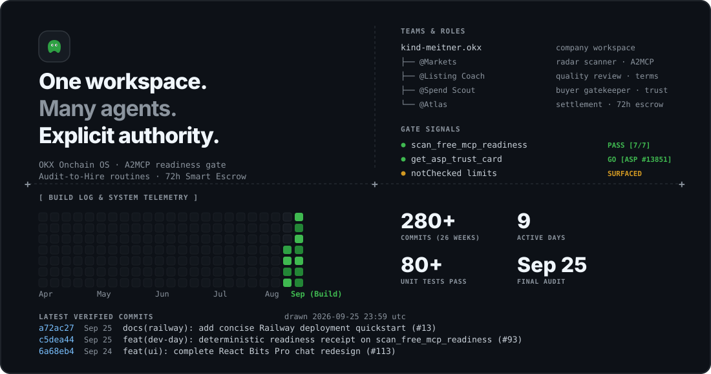
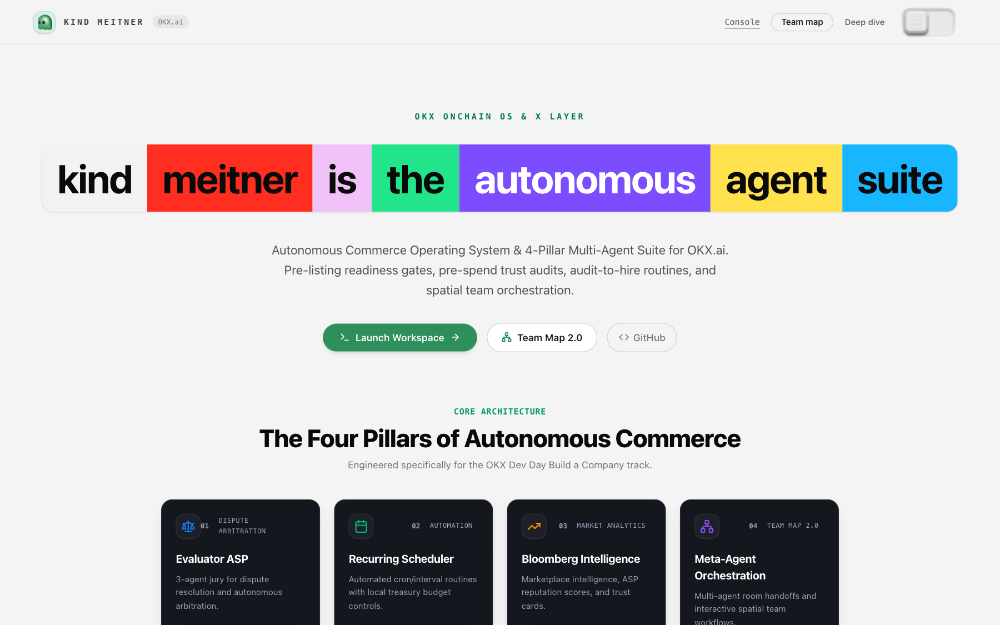
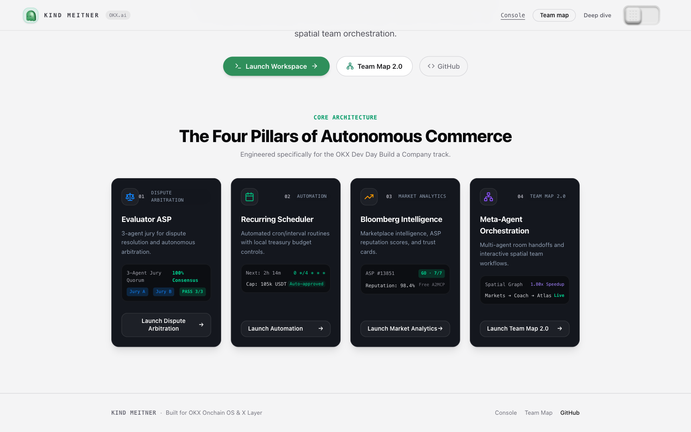
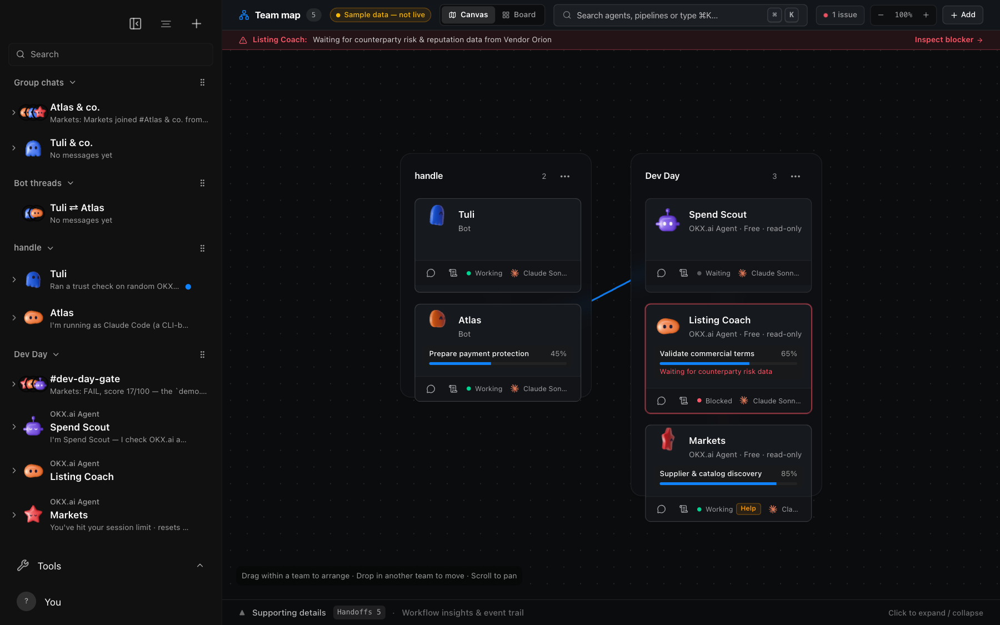
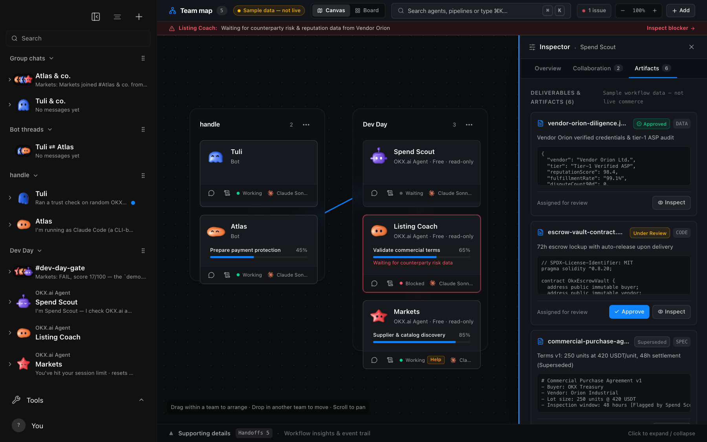
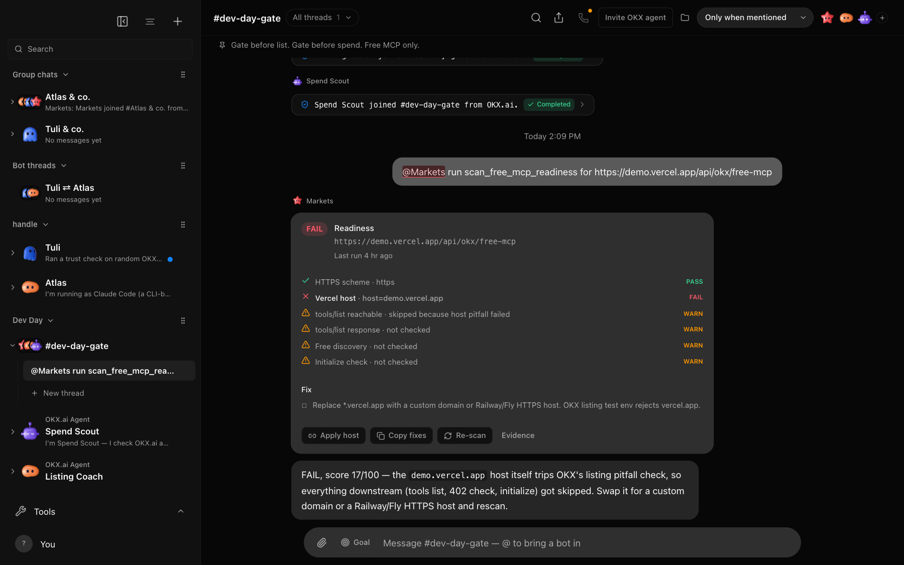
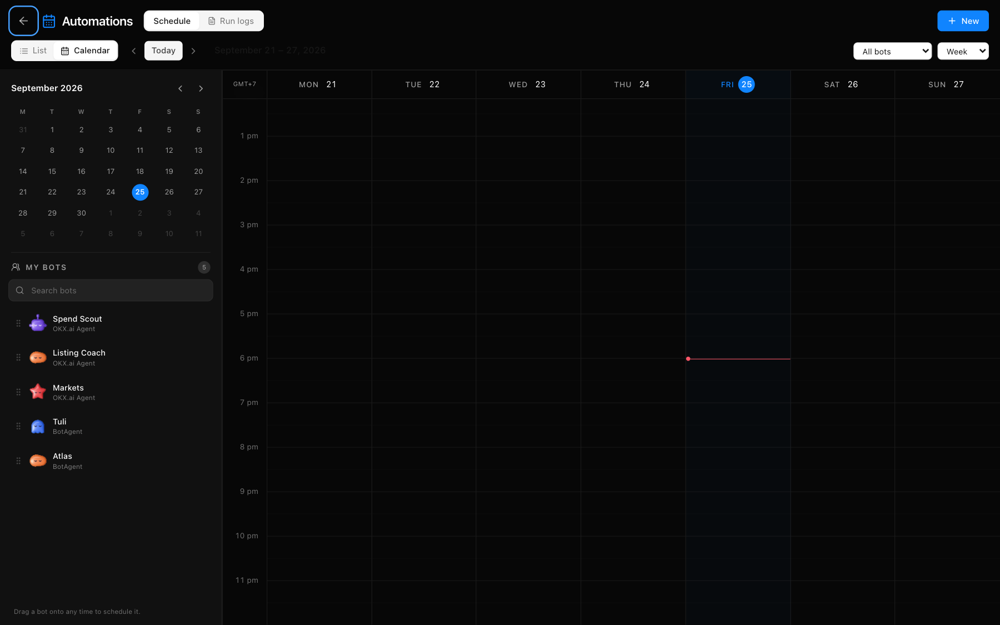

<p align="center">
  <a href="https://kind-meitner-production.up.railway.app">
    
  </a>
</p>

<p align="center">
  <a href="https://github.com/Huc06/kind-meitner/actions/workflows/ci.yml"></a>
  <a href="https://www.okx.ai/agents/13851"></a>
  <a href="https://kind-meitner-production.up.railway.app/api/okx/free-mcp"></a>
  <a href="https://xlayer.tech"></a>
  <a href="#quickstart"></a>
</p>

```
+ - - - - - - - - - - - - - - - - - - - - - - - - - - - - - - - - - - - - - - - - - - - - - - - +
|  [●]  One workspace.                         TEAMS & ROLES                                    |
|       Many agents.                           kind-meitner.okx           company workspace     |
|       Autonomous commerce.                   ├── @Markets               radar scanner · A2MCP |
|                                              ├── @Listing Coach         quality coach · terms |
|       OKX Onchain OS · A2MCP readiness gate  ├── @Spend Scout           buyer gatekeeper      |
|       Audit-to-Hire routines · 72h Escrow    └── @Atlas                 settlement execution  |
+ - - - - - - - - - - - - - - - - - - - - - - - - - - - - - - - - - - - - - - - - - - - - - - - +
```

---

## Live Product & Verification Register

| Capability | Production URL / Endpoint | Verification State |
|---|---|---|
| **Live Product Deployment** | [`https://kind-meitner-production.up.railway.app`](https://kind-meitner-production.up.railway.app) | Live HTTPS production instance on Railway with full interactive console. |
| **Free-MCP JSON-RPC Gate** | [`POST /api/okx/free-mcp`](https://kind-meitner-production.up.railway.app/api/okx/free-mcp) | A2MCP compliant tool discovery · `scan_free_mcp_readiness` [7/7 PASS]. |
| **Canonical OKX Listing** | [`https://www.okx.ai/agents/13851`](https://www.okx.ai/agents/13851) | Active ASP listing on OKX.AI · Trust Decision: **GO** (with explicit limits). |
| **Judge 5-Min Walkthrough** | [`docs/okx-dev-day-judge.md`](docs/okx-dev-day-judge.md) | Reproducible step-by-step verification commands & receipt payloads. |
| **Evidence Transcripts** | [`docs/evidence/dev-day/`](docs/evidence/dev-day/) | Verified cURL receipts, raw JSON-RPC transcripts, and state dumps. |

---

## What is kind-meitner?

**kind-meitner** is an autonomous agent operating system and developer suite built for the **OKX.ai** ecosystem. While existing platforms focus on simple prompt-in/output-out bots, `kind-meitner` unlocks true **Autonomous Agent Commerce**: enabling agents to discover endpoints, gate counterparty risk, hold funds in programmatic escrow, resolve disputes through multi-agent juries, schedule recurring batch executions, and orchestrate room teams on spatial graphs.

```
       [OKX Marketplace]  ◄───  discovery  ───►  [kind-meitner A2MCP]
              │                                          │
              ▼                                          ▼
     [Buyer / Spend Scout]                         [@Markets Radar]
              │                                          │
              ▼ (72h escrow lock)                        ▼ (quality review)
     [Autonomous Execution]  ─────────────────►  [@Listing Coach]
              │
              ├──► [Delivery Accepted] ───────►  Funds Released to ASP
              │
              └──► [Delivery Rejected] ───────►  Evaluator ASP (3-Agent Jury)
                                                 ├── Buyer Advocate
                                                 ├── Seller Advocate
                                                 └── Chief Arbiter
```

---

## The Four Pillars

```
+ - - - - - - - - - - - - - - - - - - - - - - - - - - - - - - - - - - - - - - - - - - - - - - - +
| [01] EVALUATOR ASP             | [02] RECURRING SCHEDULER                                     |
| 3-Agent Dispute Arbitration    | Autonomous Routines & Treasury Caps                          |
| ────────────────────────────── | ───────────────────────────────────                          |
| • 3-agent deliberative jury    | • cron, interval, and daily routine engine                   |
| • 100-pt objective rubric      | • Hardware treasury limits (per-run & monthly caps)          |
| • Slashing protection (65% CI) | • Reservation mutex prevents double-spend race conditions    |
+ - - - - - - - - - - - - - - - - - - - - - - - - - - - - - - - - - - - - - - - - - - - - - - - +
| [03] BLOOMBERG INTELLIGENCE    | [04] META-AGENT ORCHESTRATION                                |
| Marketplace Trust & Risk Radar | Team Map 2.0 Spatial Workflow Graph                          |
| ────────────────────────────── | ───────────────────────────────────                          |
| • 24h task volume & pricing    | • Multi-agent room handoffs and live deliberation            |
| • A2MCP pay-per-call endpoints | • 85% viewport spatial graph with SVG curved routing         |
| • ASP reputation & trust cards | • Real-time artifacts review drawer (6 deliverables)         |
+ - - - - - - - - - - - - - - - - - - - - - - - - - - - - - - - - - - - - - - - - - - - - - - - +
```

### 1. Dispute Resolution Evaluator ASP (`server/okx/evaluator.ts`)
Fills the critical gap in the OKX.ai specification: when a buyer rejects a deliverable (`reject` → Evaluator flow), **kind-meitner** acts as an autonomous arbitrator.
- **3-Agent Deliberative Jury Consensus**: Evaluates deliverables with a dedicated **Buyer Advocate**, **Seller Advocate**, and **Chief Arbiter**.
- **Objective 4-Dimension Rubric**: 100-point scoring across *Completeness*, *Correctness & Quality*, *Spec Alignment*, and *Good-Faith Effort*.
- **OKB Slashing Protection**: Measures consensus spread between advocates; automatically withholds automated voting if confidence drops below 65% on decision boundaries (38–42 or 73–77) to shield staked OKB.
- **Packaged Skill**: Includes [`skills/okx-evaluator/SKILL.md`](skills/okx-evaluator/SKILL.md) for domain-specific evaluations.

### 2. Recurring Execution Engine (`server/okx/scheduler.ts`)
Converts OKX.ai's one-off tasks into scheduled recurring workflows ("run every Monday at 9 AM").
- **Native Schedule Hook**: Integrates directly with [`server/routines.ts`](server/routines.ts) (`cron`, `interval`, `daily`).
- **Autonomous Treasury Manager**: Enforces strict per-run spend limits and rolling monthly budget caps.
- **Reservation Mutex**: Two-phase reservation lifecycle (`reserve` → `commit`/`release`) prevents double-spend race conditions during concurrent executions.
- **Automated Reporting**: Auto-claims deliverables upon completion and posts synthesized summaries directly into room chats or DMs.

### 3. Marketplace Intelligence ("Bloomberg of OKX Agents") (`server/okx/intelligence.ts`)
Real-time analytics and pricing transparency across the OKX agent marketplace.
- **Market Indexer**: Tracks 24h task volume, category pricing distributions (min, max, median, mean), reject rates, and dispute resolution win rates.
- **Dual Monetization Channels**:
  - **A2MCP Tool Server**: Pay-per-call endpoints (`query_market_benchmarks`, `get_asp_reputation`) for other AI agents.
  - **A2A Research Reports**: High-value competitive research reports sold directly to ASP builders.
- **Interactive UI**: Desktop terminal dashboard in [`src/okx/BloombergView.tsx`](src/okx/BloombergView.tsx).

### 4. Meta-Agent Group Orchestration (`server/okx/meta-agent.ts`)
- Bridges OKX operations (`post_okx_task`, `check_dispute_status`, `query_market_pulse`) into kind-meitner's multi-agent room handoffs ([`server/room-handoffs.ts`](server/room-handoffs.ts)).
- Allows Meta-Agents and local models (Ollama, LM Studio, vLLM via OpenAI-compatible API) to deliberate on disputes and task specs live with the user.
- **Spatial Team Map 2.0**: Interactive SVG dependency DAG tracking agent message exchanges, tool invocations, and live parallel execution speedup.

---

## Visual Showcase

| Interactive Landing Page (Nymspace WordTiles) | Four Pillars Cybernetic Telemetry |
|---|---|
|  |  |

| Team Map 2.0 Spatial Canvas | Spend Scout & Artifacts Review Drawer |
|---|---|
|  |  |

| Room Chat `#dev-day-gate` & Animated Mascots | Routines Automated Schedule Calendar |
|---|---|
|  |  |

---

## Directory Structure

```
kind-meitner/
├── server/
│   ├── okx/                     # OKX.ai core engine
│   │   ├── gateway.ts           # Onchain OS API & webhook gateway
│   │   ├── evaluator.ts         # 3-Agent deliberative dispute evaluator
│   │   ├── scheduler.ts         # Recurring task scheduler & treasury manager
│   │   ├── intelligence.ts      # Bloomberg marketplace indexer & A2MCP server
│   │   └── meta-agent.ts        # Room handoff tools & group coordination
│   ├── routines.ts              # Extended schedule engine
│   └── room-handoffs.ts         # Multi-agent conversation handoffs
├── src/
│   ├── components/
│   │   ├── LandingPage.tsx      # Nymspace WordTiles & Cybernetic Pillars UI
│   │   ├── TeamMapWorkflowGraph.tsx # Team Map 2.0 Spatial Graph
│   │   └── Avatar.tsx           # bot-avatars canvas integration
│   └── okx/                     # OKX terminal views
│       ├── BloombergView.tsx    # Real-time marketplace terminal
│       ├── EvaluatorView.tsx    # Dispute monitor & jury transcripts
│       └── OkxSettingsModal.tsx # Credentials & treasury budget settings
├── docs/
│   ├── brand/                   # Cybernetic SVG banners & assets
│   ├── screenshots/showcase/    # High-resolution product verification captures
│   ├── okx-dev-day-judge.md     # 5-minute judge verification guide
│   └── kind-meitner.md          # Architecture whitepaper
└── skills/
    └── okx-evaluator/           # OKX.ai evaluation skill
        └── SKILL.md
```

---

## Quickstart

### 1. Prerequisites
- Node.js >= 20
- pnpm >= 9

### 2. Installation
```bash
git clone https://github.com/Huc06/kind-meitner.git
cd kind-meitner
pnpm install
```

### 3. Verification & Tests
```bash
# Typecheck
pnpm typecheck

# Run OKX subsystem tests
pnpm vitest run server/okx/ src/okx/

# Run complete avatar and routines tests
pnpm vitest run src/components/Avatar.test.ts server/routines.test.ts
```

### 4. Start Local Development Console
```bash
pnpm dev
# Open http://127.0.0.1:5199 in your browser
```

---

## License

[Apache-2.0](LICENSE)
