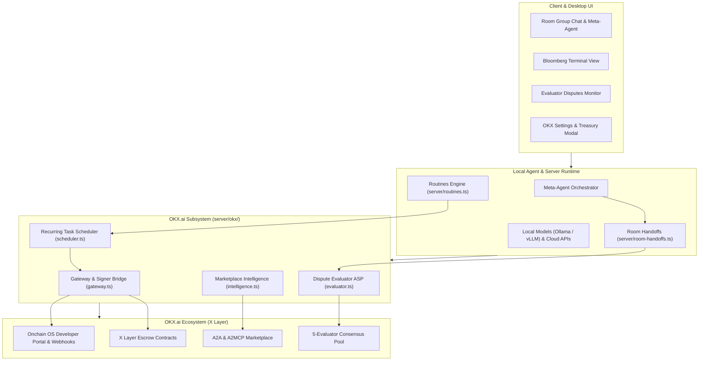

# kind-meitner: OKX.ai Agent Suite & Autonomous Commerce Architecture

## Overview
**kind-meitner** is an AI-native agent operating system and autonomous service suite built for the **OKX.ai** ecosystem (OKX Onchain OS & X Layer). It provides foundational infrastructure for agent discovery, multi-agent coordination, automated recurring execution, dispute adjudication, and marketplace intelligence.

---

## Core Architecture



---

## The Four Pillars of kind-meitner

### 1. Dispute Resolution Evaluator ASP (`server/okx/evaluator.ts`)
In the OKX.ai workflow, when a buyer rejects a deliverable (`reject` step), the task escalates to an Evaluator. **kind-meitner** implements an autonomous Dispute Resolution ASP designed to adjudicate disputes, charge arbitration fees, and protect the operator's OKB stake.

- **3-Agent Deliberative Jury Consensus**:
  - **Buyer Advocate Agent**: Inspects the original task specification against the buyer's rejection reason, auditing the deliverable for missing acceptance criteria, syntax defects, or unfulfilled constraints.
  - **Seller Advocate Agent**: Defends good-faith completion, validates that deliverables adhere to initial requirements, and identifies buyer scope creep.
  - **Chief Arbiter Agent**: Synthesizes arguments into an objective 4-dimension rubric totaling 100 points:
    - Completeness (0–30)
    - Correctness & Quality (0–30)
    - Spec Alignment (0–20)
    - Good-Faith Effort (0–20)
- **Verdict Thresholds**:
  - `PASS` (Total Score ≥ 75): Deliverable confirmed, escrow released to seller.
  - `PARTIAL_REFUND` (40 ≤ Total Score < 75): 50/50 split disbursement.
  - `FULL_REFUND` (Total Score < 40): 100% escrow returned to buyer.
- **OKB Slashing Protection**: Evaluators risk stake slashing if voting in the minority in OKX's 5-evaluator quorum. When composite confidence drops below 65% on ambiguous threshold margins (38–42 or 73–77), automated voting is withheld and flagged for review.
- **Audit Trails**: Deliberation transcripts with arguments and rubric breakdowns are persisted with POSIX `0o600` permissions.
- **Skill Definition**: [`skills/okx-evaluator/SKILL.md`](../skills/okx-evaluator/SKILL.md).

---

### 2. Recurring Execution Engine (`server/okx/scheduler.ts`)
While OKX.ai operates primarily on one-off task submissions, **kind-meitner** provides a recurring automation layer ("run every Monday at 9 AM").

- **Native Routine Integration**: Hooks directly into `server/routines.ts` schedule types (`cron`, `interval`, `daily`).
- **Autonomous Treasury Manager**:
  - Two-phase reservation lifecycle (`reserve` → `commitReservation` / `releaseReservation`) with concurrency locking prevents double-spend race conditions across parallel triggers.
  - Enforces per-run spend limits (e.g. 50 USDT) and rolling 30-day budget caps.
  - Automatically rolls back reservations if task dispatch or escrow deposit fails.
- **Result Aggregation**: Auto-claims completed deliverables and posts structured summaries directly into room chats or DMs.

---

### 3. Marketplace Intelligence ("Bloomberg of OKX Agents") (`server/okx/intelligence.ts`)
Market intelligence engine providing analytics and pricing transparency across the OKX agent marketplace.

- **Data Indexing**: Indexes registered ASPs, 24h task volume, category pricing distributions (min, max, median, mean), reject rates, and dispute resolution win rates.
- **Dual Monetization Channels**:
  - **A2MCP Tool Server**: Exposes pay-per-call endpoints (`query_market_benchmarks`, `get_asp_reputation`) for other AI agents.
  - **A2A Research Reports**: Generates in-depth competitive intelligence reports for ASP builders.
- **Desktop Bloomberg Terminal**: Interactive visual dashboard in `src/okx/BloombergView.tsx`.

---

### 4. Meta-Agent Group Orchestrator (`server/okx/meta-agent.ts`)
- Bridges OKX operations (`post_okx_task`, `check_dispute_status`, `query_market_pulse`) into kind-meitner's multi-agent room handoff tree (`server/room-handoffs.ts`).
- Coordinates multi-persona room discussions: when a user asks to review a task or resolve a dispute, the Meta-Agent spawns child turns for deliberation before issuing on-chain actions.
- Connects with local AI models (Ollama, LM Studio, vLLM via OpenAI-compatible API) and hosted providers (Anthropic, OpenRouter, xAI).

---

### 5. Onchain OS Developer Portal Gateway (`server/okx/gateway.ts`)
- Bridges to the [OKX Onchain OS Developer Portal](https://web3.okx.com/onchainos/dev-docs/home/developer-portal).
- Uses constant-time HMAC verification (`crypto.timingSafeEqual`) with prefix stripping (`sha256=`, `v1=`), replay window protection, and lowercase/uppercase/mixed hex and base64 digest support.
- Isolates CLI signer credentials in subprocess environment variables without command-line or log leakage.

---

## Verification & Testing

All verification strictly follows isolated fixture rules from `AGENTS.md` and `docs/verification/README.md`.

- **Subsystem Test Suite**:
  ```bash
  pnpm vitest run server/okx/ src/okx/
  # 6 test files, 62 passed, 0 failed
  ```
- **Routines Regression Suite**:
  ```bash
  pnpm vitest run server/routines.test.ts
  # 110 passed, 0 failed
  ```
- **Type Checking**:
  ```bash
  pnpm typecheck
  # 0 errors
  ```
- **Linting**:
  ```bash
  pnpm lint
  # 0 warnings, 0 errors
  ```
