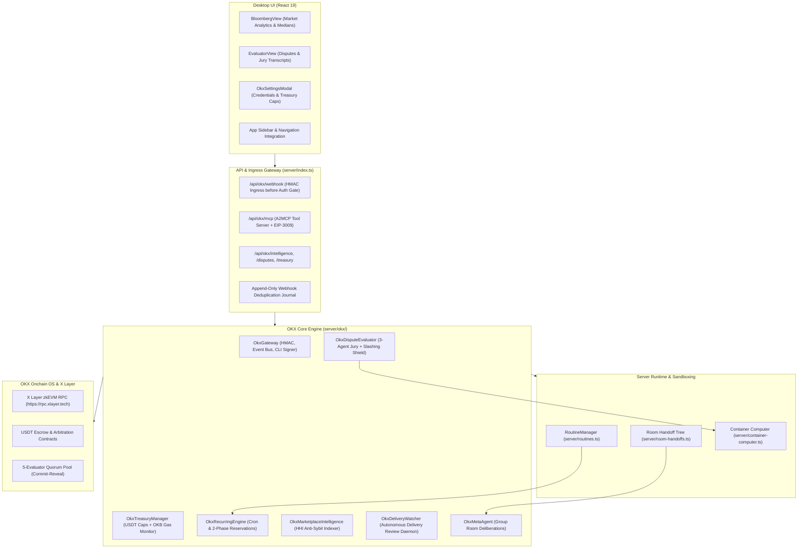

# Deep Architectural Specification & Implementation Roadmap: OKX.ai Feature Suite

> **A2MCP re-baseline — 2026-09-15:** The payment, mainnet, A2A, and Evaluator rollout assumptions below are historical and are **not** the current implementation contract. Follow the canonical [Free A2MCP → x402 roadmap](plans/2026-09-15-okx-a2mcp-roadmap.md): public read-only Free A2MCP first, official x402 on X Layer testnet second, and a separate explicit mainnet readiness approval last. In particular, the custom EIP-3009 path must not be registered or represented as paid settlement.

## Executive Summary

**kind-meitner** is an autonomous agent operating system and commerce layer on **OKX Onchain OS** and **X Layer** (Polygon CDK zkEVM, Chain ID 196/195, native gas token OKB, settlement in USDT/ERC-20).

Following an exhaustive architectural review and code audit, this document details the deep technical planning, protocol mechanics, edge-case hardening, and a phased roadmap for the OKX.ai feature suite.

---

## 1. System Architecture Overview

---

## 2. Critical Protocol Analysis & Hardening

### 2.1 Routine Execution Lifecycle & Thread Starvation
- **Problem**: When a routine targets `okx-task`, `run.status` is set to `"running"` and `startOkxTask` is invoked. However, the routine engine never transitioned `run.status` to `"completed"`, discarded the return output, left `run.finishedAt` undefined, and left the created conversation thread empty with 0 messages. This left the UI in an infinite spinner and permanently locked single-concurrency triggers.
- **Architectural Solution**:
  1. Add `finishOkxRun(runId: string, output: string)` to `RoutineManager`.
  2. In `server/index.ts`, when `executeScheduledRun` returns `{ ok: true, output }`:
     - Append a rich markdown card to the conversation thread: `store.appendMessage(run.threadId, { role: "bot", kind: "activity", text: output })`.
     - Call `routines.finishOkxRun(run.id, output)`, closing the run receipt, setting `finishedAt`, and clearing the spinner.

### 2.2 Public Webhook Ingress vs. Session Authentication Gate
- **Problem**: `server/index.ts` gates all `/api/*` routes with session cookie / bearer authentication at line 9679 (`if (!gate.auth) return json(res, gate.status, ...)`). Remote OKX Developer Portal webhooks carry HMAC signatures (`x-okx-signature`), not user session tokens, causing all external callbacks to fail with `401 Unauthorized`.
- **Architectural Solution**:
  - Mount `POST /api/okx/webhook` before the session authentication gate (adjacent to `/api/health` and `/api/brand`).
  - Pass the raw request buffer to `gateway.handleWebhook(rawBody, headers, { requireSecret: true })`.
  - Maintain an append-only JSON deduplication journal (`okx-webhook-journal.json`) to guarantee idempotent event processing.

### 2.3 Mathematical Slashing Deadband Barrier
- **Problem**: The OKX 5-evaluator pool requires majority consensus (3/5). Minorities face stake slashing. The specification dictates withholding automated voting on ambiguous decision boundaries ($[38, 42]$ for refund and $[73, 77]$ for pass). Linear margin formulas can still yield composite confidence $\ge 0.65$ on threshold edges (e.g. scores 41 or 76).
- **Hardened Barrier Formula**:
  $$\Delta_{40} = |S - 40|, \quad \Delta_{75} = |S - 75|$$
  $$\text{isDeadband} = (\Delta_{40} \le 3) \lor (\Delta_{75} \le 3)$$
  - If `isDeadband` is true: clamp $\text{marginConfidence} = 0.20 \implies \text{compositeConfidence} < 0.65 \implies \text{safeToVote} = \text{false}$.
  - For scores outside the deadbands:
    $$\text{effectiveMargin} = \min(\Delta_{40}, \Delta_{75}) - 3$$
    $$\text{marginConfidence} = \min\left(1.0, 0.50 + \left(\frac{\text{effectiveMargin}}{10}\right)^2 \times 0.50\right)$$
  - Disputes landing in deadband zones are flagged for Meta-Agent group discussion or human-in-the-loop review.

### 2.4 X Layer zkEVM Settlement: Gas Decoupling & Nonce Mutex
- **Gas vs. Escrow Decoupling**: On X Layer (Chain ID 196), gas is paid in native **OKB**, while task escrows and settlements operate in **USDT** (ERC-20). The treasury manager must maintain dual ledgers:
  - Check native OKB balance before every on-chain transaction (`minGasThreshold = 0.05 OKB`).
  - Emit `TreasuryLowGasWarning` if OKB balance drops below the execution threshold.
- **Nonce Mutex**: Wrap all CLI signer invocations in a `SerializedTransactionExecutor` queue to eliminate nonce race conditions when multiple scheduled routines fire concurrently.

### 2.5 5-Evaluator Quorum Game Theory: Commit-Reveal Protection
- **Vulnerability**: Open transaction voting enables lazy or adversarial evaluators to monitor the mempool, copy kind-meitner's reasoned verdict, and front-run the reveal while avoiding LLM compute costs.
- **Protocol Defense**:
  - **Commit Phase**: Submit $\text{keccak256}(\text{verdict} \parallel \text{salt} \parallel \text{evaluatorAddress})$ to the smart contract.
  - **Reveal Phase**: Once all 5 evaluators commit or the commit window closes, broadcast $(\text{verdict}, \text{salt})$.
  - Store salted commitments locally in `okx-evaluator.json` with POSIX `0o600` permissions.

### 2.6 Executable Artifact Verification Sandbox
- Instead of relying solely on keyword scanning in deliverable text, route deliverables with code or git repositories through `server/container-computer.ts`.
- Execute automated builds and unit tests in an isolated, non-networked container.
- Supply verified build exit codes, test pass counts, and coverage metrics directly into the Chief Arbiter rubric.

### 2.7 Autonomous Delivery Watcher Daemon (`server/okx/watcher.ts`)
- Continuously polls active tasks or listens to `delivery_submitted` webhook events.
- Automatically initiates acceptance criteria reviews.
- Calls `gateway.cli.agentAccept(taskId)` on passing deliverables or `gateway.cli.agentReject(taskId, grievance)` on failed deliverables within the 72-hour escrow window.

### 2.8 A2MCP Tool Monetization & EIP-3009 Settlement
- Expose the Marketplace Intelligence endpoints as an MCP tool server at `/api/okx/mcp`.
- Require calling external agents to provide EIP-3009 `TransferWithAuthorization` headers for 0.05 USDT per query.
- Periodically batch collected authorizations into on-chain settlements on X Layer.

---

## 3. Implementation Roadmap

### Phase 1: Ingress, State Persistence & Server Wiring
- [ ] Mount public `POST /api/okx/webhook` before session auth in `server/index.ts`.
- [ ] Implement `okx-webhook-journal.json` for idempotent event handling.
- [ ] Inherit `OkxGateway` from `EventEmitter` and broadcast typed domain events.
- [ ] Serialize and restore treasury reservations in `server/okx/scheduler.ts`.
- [ ] Add `OkbGasMonitor` to `OkxTreasuryManager`.
- [ ] Instantiate durable singleton instances of evaluator and intelligence engines in `server/index.ts`.

### Phase 2: Lifecycle Reconciliation & Delivery Watcher
- [ ] Add `finishOkxRun` to `RoutineManager` and update `startOkxTask` to append activity cards to threads.
- [ ] Implement `OkxDeliveryWatcher` (`server/okx/watcher.ts`) to review deliverables within the 72-hour window.
- [ ] Implement missing CLI operations in `OkxCliSigner`: `agentAccept`, `agentReject`, `evaluatorClaim`, `walletBalance`.
- [ ] Replace synthetic mock hashes (`0x...` UUIDs) with true execution error propagation.

### Phase 3: Evaluator Hardening & Sandbox Verification
- [ ] Implement XML tag framing and prompt injection defenses in jury advocates.
- [ ] Enforce the mathematical deadband barrier function in `server/okx/evaluator.ts`.
- [ ] Integrate deliverable test execution with `server/container-computer.ts`.
- [ ] Implement commit-reveal voting support for the 5-evaluator quorum pool.

### Phase 4: Desktop UI Integration & A2MCP Settlement
- [ ] Add `"okx-bloomberg"` and `"okx-evaluator"` views to `src/state/store.tsx` and `src/App.tsx`.
- [ ] Add Bloomberg and Evaluator navigation icons to `src/components/Sidebar.tsx`.
- [ ] Wire authenticated REST endpoints in `server/index.ts` for intelligence, disputes, and treasury.
- [ ] Mount `/api/okx/mcp` endpoint with EIP-3009 micro-payment authorization.
- [ ] Implement Herfindahl-Hirschman Index (HHI) counterparty concentration scoring in marketplace intelligence.

---

## 4. Verification & Testing Strategy

- **Isolated Fixtures**: All tests run against mocked X Layer RPCs, mock Developer Portal webhooks, and isolated file fixtures pursuant to `AGENTS.md` and `docs/verification/README.md`.
- **Regression Invariance**: Core routines test suite (`server/routines.test.ts`) must maintain 100% passing rate (110/110).
- **Continuous Static Analysis**: 0 warnings in `pnpm lint` (`oxlint --deny-warnings .`) and 0 type errors in `pnpm typecheck`.
