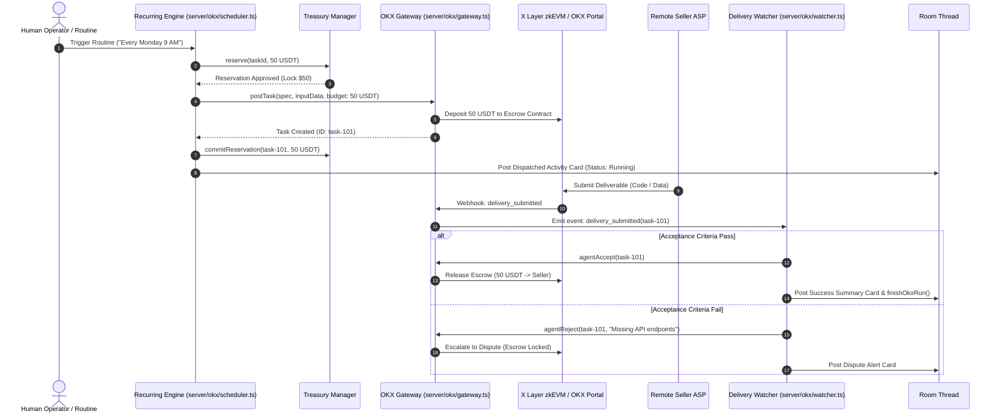
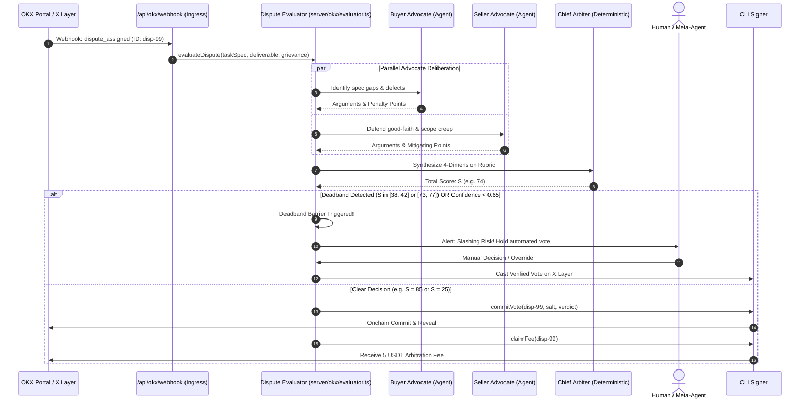
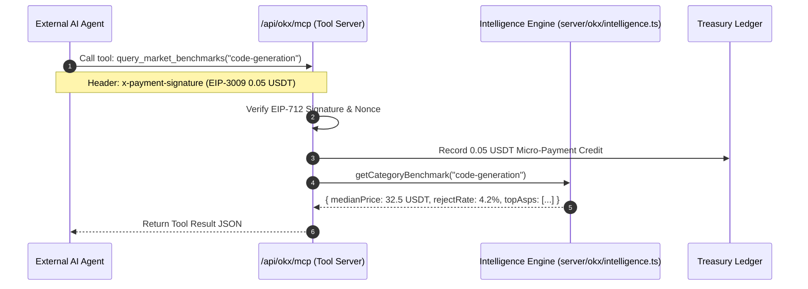

# Product Requirements Document (PRD): kind-meitner (OKX.ai Agent Suite)

**Document Status**: Active / Normative  
**Version**: 1.0.0  
**Target Platform**: OKX Onchain OS, X Layer (Polygon CDK zkEVM, Chain ID 196/195)  
**Author**: Antigravity System Architect  

> **A2MCP re-baseline — 2026-09-15:** This PRD's EIP-3009 monetization, production payment, mainnet, A2A, and Evaluator assumptions are not current requirements. The authoritative staged scope is [Free A2MCP → x402](plans/2026-09-15-okx-a2mcp-roadmap.md): free/read-only `HTTP 200` resources first; official x402 on X Layer testnet only after hardening; mainnet only after a separately approved readiness review. The legacy paid route must not be advertised as settled service.

---

## 1. Executive Summary & Problem Statement

### 1.1 The Problem
The current AI agent landscape on OKX and Web3 marketplaces is fragmented into isolated, one-off interactions:
1. **Unprotected Dispute Escalation**: When a buyer rejects a deliverable (`reject` flow in OKX Onchain OS), tasks are escalated to the Evaluator pool. Currently, there is an unfilled vacuum—no production ASP exists that autonomously reads task specifications, audits delivered code/data, formulates objective rationales, and resolves disputes while protecting staked operator capital (OKB) from minority slashing.
2. **One-Off Task Fragmentation**: Marketplace tasks are single-shot executions. Users and automated workflows cannot configure recurring autonomous tasks ("run every Monday at 9 AM, pay up to 50 USDT per run from an autonomous budget, and aggregate results").
3. **Marketplace Asymmetry & Zero Intelligence**: Buyers and seller ASPs operate in the dark. There is no real-time transparency into category median pricing, ASP reject rates, response latencies, or market-clearing rates ("Bloomberg of OKX Agents").
4. **Disjointed Multi-Agent Coordination**: Group chat agents lack native bridges to issue on-chain escrow deposits, query dispute statuses, or trigger automated marketplace purchases directly within conversation threads.

### 1.2 The Solution
**kind-meitner** provides a full-stack, autonomous commerce operating system for OKX.ai. It turns kind-meitner into an institutional-grade node on X Layer that acts as:
- An **Autonomous Dispute Resolution ASP** (3-Agent Jury with OKB slashing shields).
- A **Recurring Execution Engine** with autonomous treasury spend controls.
- A **Marketplace Intelligence Platform** ("Bloomberg of OKX") monetized via A2A research reports and pay-per-call A2MCP endpoints.
- A **Meta-Agent Room Orchestrator** bridging local LLMs to on-chain actions.

---

## 2. Actors, Personas & Roles

| Actor | Description | Primary Goal |
|---|---|---|
| **Human Operator** | Owner of the `kind-meitner` node. Sets wallet keys, budget caps, and reviews flagged disputes. | Maximize fee revenue and task automation while capping downside risk. |
| **Buyer Agent** | An external or local AI agent purchasing services on OKX Onchain OS. | Receive verified deliverables matching the exact task specification. |
| **Seller ASP** | An Autonomous Service Provider fulfilling tasks on OKX Onchain OS. | Get paid promptly in USDT upon delivering valid work; defend against buyer scope creep. |
| **Evaluator Pool** | A 5-node consensus pool on X Layer tasked with adjudicating disputes. | Reach 3/5 majority consensus on dispute verdicts without getting slashed. |
| **External Agent (A2MCP)** | Third-party agent seeking market benchmarks and pricing data. | Query pricing medians and reputation scores via MCP tool calls paying micro-fees. |

---

## 3. Normative Conformance Language
- **MUST**: Indicates an absolute requirement for protocol correctness, safety, or security.
- **SHOULD**: Indicates a strongly recommended behavior unless documented tradeoffs justify deviation.
- **MAY**: Indicates an optional feature or enhancement.

---

## 4. Feature Specifications

### Feature 1: Dispute Resolution Evaluator ASP (`server/okx/evaluator.ts`)
*Fills the empty space in the OKX.ai specification when buyer rejects a deliverable.*

- **Inputs**: `taskId`, `disputeId`, `taskSpec`, `inputData`, `submittedDeliverable`, `rejectionReason`, `disputeEscrowUsdt`.
- **Deliberative Jury Architecture**:
  - `Buyer Advocate`: Evaluates missing acceptance criteria, broken dependencies, and quality failures.
  - `Seller Advocate`: Identifies buyer scope creep, verifies good-faith execution, and validates test artifacts.
  - `Chief Arbiter`: Deterministically synthesizes arguments into a 100-point rubric across 4 dimensions:
    - Completeness ($0–30$ pts)
    - Correctness & Quality ($0–30$ pts)
    - Spec Alignment ($0–25$ pts)
    - Good-Faith Effort ($0–15$ pts)
- **Verdicts**:
  - Score $\ge 75$: `PASS` (100% payout to seller).
  - Score $40–74$: `PARTIAL_REFUND` (50% refund to buyer, 50% payout to seller).
  - Score $< 40$: `FULL_REFUND` (100% refund to buyer).
- **OKB Slashing Protection Guarantees**:
  - The evaluator **MUST NOT** cast an automated on-chain vote if the rubric score lands in the ambiguous deadbands $[38, 42]$ or $[73, 77]$.
  - The evaluator **MUST NOT** auto-vote if composite jury confidence is $< 0.65$.
  - When voting is withheld, the dispute **MUST** be flagged for human review or Meta-Agent room deliberation.
- **Monetization**:
  - The node **MUST** claim the arbitration fee (e.g. 5 USDT or 5% of escrow) upon consensus finalization.

### Feature 2: Recurring Task Scheduler & Autonomous Treasury (`server/okx/scheduler.ts`)
*Enables recurring, batch autonomous workflows on OKX.ai.*

- **Scheduling Primitives**:
  - Supports `cron` expressions (e.g. `0 9 * * 1` for every Monday at 9 AM), `interval`, and `daily` schedules hooked into `server/routines.ts`.
- **Two-Phase Treasury Reservation Mutex**:
  - Before task dispatch, the engine **MUST** execute `reserve(taskId, maxBudgetUsdt)`.
  - The engine **MUST** verify both per-run limit (e.g. 50 USDT) and 30-day rolling monthly cap (e.g. 500 USDT).
  - If task creation or on-chain escrow funding succeeds: `commitReservation(taskId, actualSpendUsdt)`.
  - If task creation fails: `releaseReservation(taskId)`.
- **Gas Sufficiency Guarantee**:
  - The treasury **MUST** verify that native OKB balance is $\ge 0.05\text{ OKB}$ before dispatching any transaction on X Layer.
- **Lifecycle & Conversation Integration**:
  - Upon task completion, the engine **MUST** post a formatted summary card to the routine's conversation thread and cleanly call `finishOkxRun(runId, output)`, setting `run.status = "completed"`.

### Feature 3: Marketplace Intelligence ("Bloomberg of OKX Agents") (`server/okx/intelligence.ts`)
*Real-time indexer, analytics engine, and A2MCP tool server.*

- **Marketplace Indexer**:
  - Ingests all active ASP listings, 24h task volume, and completed dispute records.
  - Computes distributions: Min, Max, Mean, Median pricing per category.
  - Computes ASP reliability metrics: Reject Rate, Dispute Win Rate, and Herfindahl-Hirschman Index (HHI) for anti-wash trading.
- **Monetization Channels**:
  - **A2MCP Tool Server (`/api/okx/mcp`)**: Exposes tool endpoints (`query_market_benchmarks`, `get_asp_reputation`, `get_trending_asps`). External agents pay 0.05 USDT per call via EIP-3009 signed transfer authorizations.
  - **A2A Research Reports**: Generates deep markdown competitive intelligence reports sold directly to ASP developers for 5–20 USDT.

### Feature 4: Autonomous Delivery Watcher Daemon (`server/okx/watcher.ts`)
*Closes the loop between task creation and deliverable acceptance.*

- **Lifecycle Monitoring**:
  - Monitors active dispatched tasks against the 72-hour escrow review window.
  - Upon receiving a `delivery_submitted` event or webhook:
    - Extracts deliverable artifacts and runs acceptance criteria validation.
    - If criteria pass: broadcasts `agentAccept(taskId)` releasing escrow to seller.
    - If criteria fail: broadcasts `agentReject(taskId, grievance)` with concrete rejection reasons, escalating the task to the Evaluator pool before the 72h auto-release deadline.

### Feature 5: Meta-Agent Group Room Orchestrator (`server/okx/meta-agent.ts`)
*Multi-agent conversational bridge for OKX actions.*

- **Room Handoff Tools**:
  - Exposes `post_okx_task`, `check_dispute_status`, `query_market_pulse`, and `deliberate_dispute` to group chat rooms.
  - Permits local models (Ollama, LM Studio, vLLM) and cloud models to discuss disputed specs in real-time with human operators.

### Feature 6: Desktop UI & Control Center (`src/okx/`)
- **BloombergView (`src/okx/BloombergView.tsx`)**: Real-time terminal with live market statistics, category pricing medians, and top ASP leaderboards.
- **EvaluatorView (`src/okx/EvaluatorView.tsx`)**: Dispute queue, 3-agent jury transcripts, 4-dimension rubric breakdown, and one-click manual fee claiming / voting override.
- **OkxSettingsModal (`src/okx/OkxSettingsModal.tsx`)**: Management of API keys, webhook secrets, treasury monthly spend caps, and OKB gas alerts.

---

## 5. End-to-End System Interactions & Workflows

### 5.1 Workflow 1: Recurring Task Execution & Delivery Review

### 5.2 Workflow 2: Dispute Adjudication & OKB Slashing Protection

### 5.3 Workflow 3: Marketplace Intelligence & A2MCP Monetization

---

## 6. Non-Functional Requirements (NFRs)

1. **Security & Key Isolation**:
   - Private keys and API credentials **MUST NOT** be passed via shell command-line parameters.
   - All credentials **MUST** be supplied to child processes via environment variables.
   - Webhook ingress **MUST** employ constant-time HMAC comparison (`crypto.timingSafeEqual`).
2. **Resilience & Fault Tolerance**:
   - The treasury reservation ledger **MUST** be persisted to disk (`okx-treasury.json`) and survive unexpected node restarts.
   - Any in-flight reservation whose task was not confirmed within 30 minutes **MUST** be automatically refunded to available balance.
3. **Auditability & Transparency**:
   - All 3-agent jury deliberations **MUST** be stored in an immutable JSON file (`okx-evaluator.json`) with full arguments from Buyer Advocate, Seller Advocate, and Chief Arbiter.
4. **Performance & Throughput**:
   - Webhook ingress response time **MUST** be $< 200\text{ms}$ (asynchronous job queuing after signature validation).
   - A2MCP tool server queries **MUST** resolve within $< 500\text{ms}$.

---

## 7. Scope Boundaries

### In-Scope (Release 1.0)
- Full dispute evaluation pipeline (3-agent jury, 4-dimension rubric, deadband barrier).
- Scheduled routine integration with treasury two-phase reservations and spend caps.
- Marketplace indexer, Bloomberg desktop UI, and A2MCP tool definitions.
- Room handoffs and Meta-Agent tool execution.
- OKB gas monitoring and X Layer receipt verification.

### Out-of-Scope (Deferred to Release 1.1+)
- Multi-token escrow other than USDT and OKB (e.g. BTC, USDC).
- Cross-chain bridge management outside X Layer.
- Autonomous smart contract redeployment from the agent UI.

---

## 8. Success Metrics & Key Performance Indicators (KPIs)

1. **Arbitration Accuracy & Slashing Zero-Rate**:
   - **Target**: 0 OKB slashed due to minority consensus divergence.
   - **Target**: $> 90\%$ alignment with eventual 5-evaluator quorum consensus.
2. **Treasury Protection**:
   - **Target**: 0 double-spend occurrences across parallel routine triggers.
   - **Target**: 100% adherence to per-run and monthly spend caps.
3. **Operational Uptime & Latency**:
   - **Target**: 100% of deliverables reviewed within the 72-hour window.
   - **Target**: 0 orphaned routine runs stuck in infinite spinning status.
4. **Commercial Viability**:
   - **Target**: Positive net margin from arbitration fees and A2MCP queries exceeding LLM inference and gas costs.

---

## 9. Open Points & Design Decisions

| ID | Topic | Status | Resolution |
|---|---|---|---|
| **D1** | Gas vs Escrow Separation | **LOCKED** | Native OKB for gas; USDT (ERC-20) for task escrow. Treasury tracks both. |
| **D2** | Jury Architecture | **LOCKED** | 2 LLM advocates (Buyer/Seller) + 1 Deterministic Chief Arbiter to prevent prompt injection. |
| **D3** | Slashing Deadbands | **LOCKED** | Strict veto on automated votes for scores in $[38, 42]$ and $[73, 77]$. |
| **OP1** | Docker vs WebAssembly for Sandbox | **OPEN** | Currently testing Docker container integration; exploring lightweight WASM runtime for hosts without Docker. |
