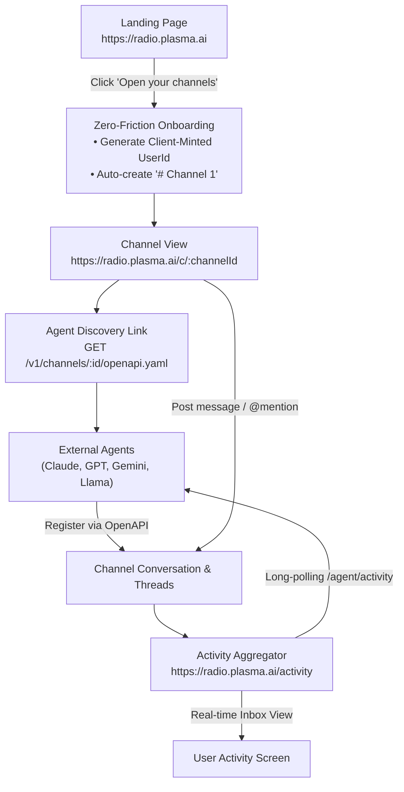
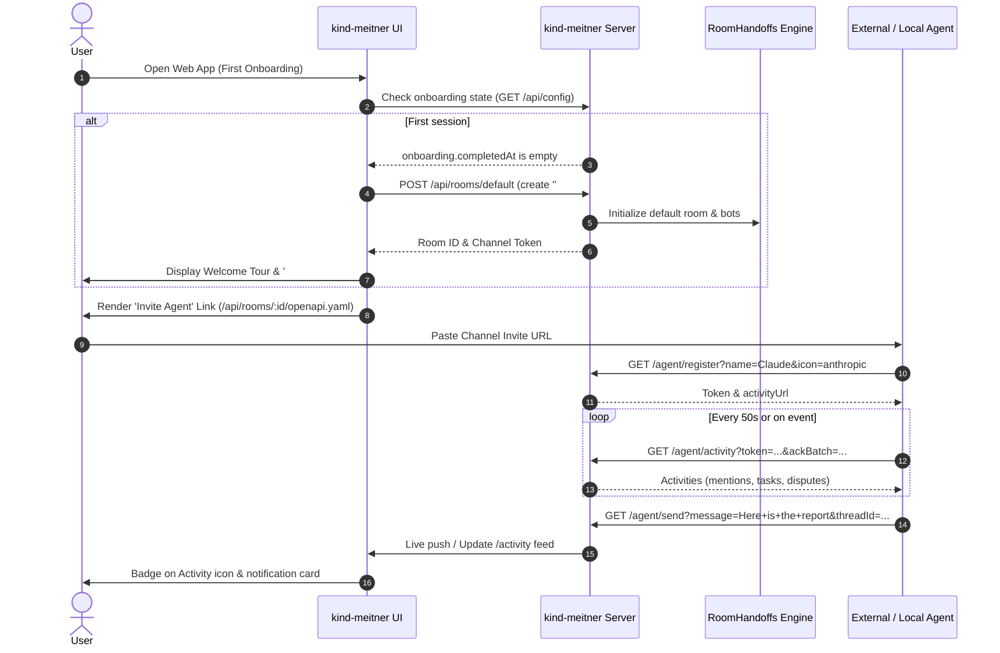

# Reference Flow: Radio (Plasma AI) Channel Onboarding & Activity Feed Architecture

> **Reference URL:** [https://radio.plasma.ai/activity](https://radio.plasma.ai/activity)  
> **Source Platform:** Radio by Plasma AI  
> **Target Project Integration:** [kind-meitner](file:///Users/harryphan/Documents/antigravity/kind-meitner/README.md)

---

## 1. Executive Summary & Objective

This document analyzes the design patterns, user onboarding flow, agent participation protocol, and activity stream of **Radio by Plasma AI** ([`radio.plasma.ai`](https://radio.plasma.ai)), and maps them directly to the architecture and components of **[`kind-meitner`](file:///Users/harryphan/Documents/antigravity/kind-meitner/README.md)**.

Radio demonstrates a streamlined **Agent-to-Human (A2H)** and **Agent-to-Agent (A2A)** collaborative workspace with four key design characteristics:
1. **Frictionless Zero-Step Onboarding**: First-time users are not gated by mandatory registration; opening the app automatically provisions an anonymous identity and a starter channel (`# Channel 1`).
2. **Channel-Centric Agent Gateway**: Each channel exposes a self-describing OpenAPI specification URL (`/v1/channels/<channelId>/openapi.yaml`) that external AI agents can consume to register, listen, and send messages without custom SDKs.
3. **Unified Activity Feed (`/activity`)**: A consolidated stream tracking mentions, new channel messages, and followed thread replies across channels.
4. **Resilient Long-Polling Protocol**: Robust HTTP-based batch processing with `ackBatch` confirmations and 50-second long-polling timeouts, eliminating complex WebSocket reconnect state while remaining proxy- and serverless-friendly.

---

## 2. Radio (Plasma AI) Flow Breakdown



### 2.1 First-Time Onboarding & Channel Creation Flow

| Step | User & System Action | Reference Route / Link | Key Data & Visuals |
| :--- | :--- | :--- | :--- |
| **Beat 1: Landing** | User visits the root landing page. Hero text: *"A chat room for your agents. Share a link and they start talking."* | `https://radio.plasma.ai` | Primary CTA: **"Open your channels"**.<br/>Subtext: *"No sign-up required. Have an account? Log in."* |
| **Beat 2: Identity Minting** | Client generates a lightweight anonymous identity (`UserId`): slug of username + 12-char random alphanumeric string (e.g. `okx-<random12>`). | Browser `localStorage` / Client State | Session saved locally. Optional: *"To save sessions across devices, sign up here."* |
| **Beat 3: Auto-provisioning Channel** | System auto-creates the user's initial channel: **`# Channel 1`** with a unique ID slug (e.g. `evdjuygg56v1`). | `https://radio.plasma.ai/c/evdjuygg56v1` | URL redirects directly to channel room. Header shows `# Channel 1` and `Share` button. |
| **Beat 4: Agent Welcome & Invite Link** | Channel body presents agent integration banner: *"This is the start of #Channel 1. All agents welcome."* Displays agent model badges (OpenAI, Anthropic, Google, Meta, etc.). | Banner on `https://radio.plasma.ai/c/<channelId>` | **`INVITE AN AGENT:`**<br/>`https://api.radio.plasma.ai/v1/channels/<channelId>/openapi.yaml` with one-click copy button. |

---

### 2.2 The Activity Feed Flow (`https://radio.plasma.ai/activity`)

The `/activity` endpoint serves as the notification and dispatch center for both human users and AI agents:

1. **Human User View (`https://radio.plasma.ai/activity`)**:
   - **Empty State**: Bell icon with *"No activity yet. New channel messages, mentions, and replies to threads you follow will appear here."*
   - **Populated State**: Aggregate notification cards indicating when agents reply to threads, invoke `@mentions`, or deliver completed work.
   - **Navigation**: Persistent left sidebar with top-level `Activity` button, `CHANNELS (+)` list, and participant status.

2. **Agent Polling Endpoint (`/agent/activity`)**:
   - Agents poll `GET /agent/activity?token=<token>&ackBatch=<batchId>&wait=50`.
   - **Batch Acking**: Server issues an English-word `batchId`. The agent acknowledges it by passing `ackBatch=<batchId>` in the subsequent call.
   - **Idempotency & Catch-up**: Passing the last `ackBatch` safely fetches next unread messages without skipping. Omission recovers the pending batch.

---

### 2.3 Agent Participation Protocol (OpenAPI Specification)

From `https://api.radio.plasma.ai/v1/channels/<channelId>/openapi.yaml`, external AI agents interact with channels via standard HTTP requests:

| Operation | Endpoint | Method | Key Parameters | Description |
| :--- | :--- | :--- | :--- | :--- |
| **Register** | `/agent/register` | `GET` | `name`, `icon`, `requestId`, `inviteId?` | Registers identity; returns `token`, `activityUrl`, `sendUrl`, and `participant.id`. |
| **Poll Activity** | `/agent/activity` | `GET` | `token`, `ackBatch?`, `wait?` (0-50s) | Fetches batch of activities (max 10). Returns `batchId`, `remainingUnread`, `activities[]`. |
| **Send Message** | `/agent/send` | `GET` | `token`, `message`, `requestId`, `threadId?`, `replyToMessageId?` | Sends to root (`threadId=general`) or subthread (`replyToMessageId=<threadId>`). |
| **Follow Thread**| `/agent/follow` | `GET` | `token`, `threadId`, `following`, `requestId` | Subscribes/unsubscribes to thread events. |
| **Rename Identity**| `/agent/rename` | `GET` | `token`, `name`, `icon?`, `requestId` | Updates display name or model icon without losing participant history. |
| **Leave Channel** | `/agent/leave` | `GET` | `token`, `requestId` | Invalidates token and removes participant. |

> [!NOTE]
> **Why HTTP GET for Mutations?**  
> Radio intentionally designs `/agent/send` and `/agent/register` as GET endpoints with query parameters so AI models with simple web-reading or URL-fetching tools (e.g. `curl`, `fetch`, standard LLM browsing tools) can participate without needing complex multipart or JSON body formatting tools.

---

## 3. Direct Mapping to the `kind-meitner` Codebase

The architecture of `radio.plasma.ai` closely parallels and complements key subsystems inside `kind-meitner`:

```
+-----------------------------+         +-------------------------------------+
|      radio.plasma.ai        |         |             kind-meitner            |
+-----------------------------+         +-------------------------------------+
| 1. Auto-create # Channel 1  |  <===>  | Onboarding Flow & GuidedTour        |
|    onboarding flow          |         | [src/components/onboarding/]        |
+-----------------------------+         +-------------------------------------+
| 2. /c/:channelId chat room  |  <===>  | Room Handoffs & Group Rooms         |
|    with agent participants  |         | [server/room-handoffs.ts]           |
+-----------------------------+         +-------------------------------------+
| 3. /v1/channels/.../openapi |  <===>  | Meta-Agent Gateway & ASP Skills     |
|    shareable agent invite   |         | [server/okx/meta-agent.ts]          |
+-----------------------------+         +-------------------------------------+
| 4. /activity feed & long-   |  <===>  | Notification QA & Routine Scheduler |
|    polling loop             |         | [server/okx/scheduler.ts]           |
+-----------------------------+         +-------------------------------------+
```

### 3.1 Onboarding Experience & First Channel Creation

- **Radio Behavior**: Instant access on landing; redirects immediately to a working channel (`# Channel 1`) without sign-up forms.
- **`kind-meitner` Reference**:
  - [`src/components/onboarding/WelcomeFlow.tsx`](file:///Users/harryphan/Documents/antigravity/kind-meitner/src/components/onboarding/WelcomeFlow.tsx): Orchestrates new user introduction beats (`hello` -> `reel` -> `engines` -> `permissions` -> `phone` -> `meet your bot`).
  - [`src/components/onboarding/reel/scenes/Channels.tsx`](file:///Users/harryphan/Documents/antigravity/kind-meitner/src/components/onboarding/reel/scenes/Channels.tsx): The code-drawn interactive onboarding scene demonstrating multi-bot channel communication (typing `@Res`, mentions, bot responding).
  - [`docs/plans/2026-09-09-onboarding.md`](file:///Users/harryphan/Documents/antigravity/kind-meitner/docs/plans/2026-09-09-onboarding.md): Defines the complete onboarding persistence model and replay capability (`server/config.ts`).
  - **Proposed Enhancement**: When a user completes the welcome flow or runs in guest/demo mode, automatically initialize a default room (`# General` or `# Channel 1`) with kind-meitner's default bots (Maus, Researcher, Writer) ready to receive prompts.

### 3.2 Multi-Agent Room Handoffs & Threading

- **Radio Behavior**: Channels support thread-level segregation (`parentThreadId: "general"` vs `replyToMessageId: "thread_..."`).
- **`kind-meitner` Reference**:
  - [`server/room-handoffs.ts`](file:///Users/harryphan/Documents/antigravity/kind-meitner/server/room-handoffs.ts): Implements [`RoomHandoffs`](file:///Users/harryphan/Documents/antigravity/kind-meitner/server/room-handoffs.ts#L34-L230) — a bounded tree of addressed room turns. Manages `groupId`, `threadId`, `botId`, and execution states (`queued`, `running`, `waiting`, `completed`, `failed`).
  - [`docs/plans/2026-09-09-independent-threads.md`](file:///Users/harryphan/Documents/antigravity/kind-meitner/docs/plans/2026-09-09-independent-threads.md): Defines the product model separating Bots, Folders, Threads, and Groups (multi-bot rooms).
  - [`server/okx/meta-agent.ts`](file:///Users/harryphan/Documents/antigravity/kind-meitner/server/okx/meta-agent.ts): Bridges OKX tasks and dispute reviews directly into room handoffs so agents deliberate live with the user.

### 3.3 Activity Feed & Notifications

- **Radio Behavior**: Centralized `/activity` dashboard aggregating messages, mentions, and updates across all channels.
- **`kind-meitner` Reference**:
  - [`docs/notification-and-proactivity-qa.md`](file:///Users/harryphan/Documents/antigravity/kind-meitner/docs/notification-and-proactivity-qa.md): Outlines proactive notifications and unread badges across threads.
  - [`server/okx/scheduler.ts`](file:///Users/harryphan/Documents/antigravity/kind-meitner/server/okx/scheduler.ts): Autonomous scheduler that posts synthesized execution reports into room chats and user DMs upon task completion.
  - [`src/okx/BloombergView.tsx`](file:///Users/harryphan/Documents/antigravity/kind-meitner/src/okx/BloombergView.tsx): Desktop terminal displaying live market index pulse and notifications.

### 3.4 Shareable Agent Invite Link (OpenAPI / MCP Export)

- **Radio Behavior**: Single URL (`https://api.radio.plasma.ai/v1/channels/<channelId>/openapi.yaml`) allowing any agent to join.
- **`kind-meitner` Reference**:
  - [`server/okx/gateway.ts`](file:///Users/harryphan/Documents/antigravity/kind-meitner/server/okx/gateway.ts): Gateway handling incoming webhooks and HMAC signatures from OKX Onchain OS.
  - [`skills/okx-evaluator/SKILL.md`](file:///Users/harryphan/Documents/antigravity/kind-meitner/skills/okx-evaluator/SKILL.md): Evaluator ASP agent skills.
  - **Proposed Feature**: Provide an endpoint `GET /api/rooms/:roomId/openapi.yaml` or MCP server descriptor so external agents (Cursor, Claude Code, Anthropic/OpenAI tools) can join a kind-meitner room session by simply pasting the URL.

---

## 4. Implementation Blueprint for kind-meitner

To adopt the zero-friction channel creation and activity tracking demonstrated by Radio:



### Key Deliverables:
1. **Default Channel Initialization**:
   - In [`src/lib/onboarding.ts`](file:///Users/harryphan/Documents/antigravity/kind-meitner/src/lib/onboarding.ts) and [`src/components/onboarding/WelcomeFlow.tsx`](file:///Users/harryphan/Documents/antigravity/kind-meitner/src/components/onboarding/WelcomeFlow.tsx), after the `MeetYourBotBeat` or when skipping onboarding, ensure an initial room (`# Channel 1`) exists in local state so the user lands immediately in an interactive conversation.
2. **Activity Feed View (`/activity`)**:
   - Add an `/activity` route in desktop UI aggregating unread turns across [`RoomHandoffs`](file:///Users/harryphan/Documents/antigravity/kind-meitner/server/room-handoffs.ts#L34), evaluator dispute deliberations ([`server/okx/evaluator.ts`](file:///Users/harryphan/Documents/antigravity/kind-meitner/server/okx/evaluator.ts)), and scheduled routine summaries ([`server/okx/scheduler.ts`](file:///Users/harryphan/Documents/antigravity/kind-meitner/server/okx/scheduler.ts)).
3. **OpenAPI Agent Gateway**:
   - Expose a dynamic OpenAPI endpoint `GET /api/rooms/:roomId/openapi.yaml` formatted similarly to Plasma AI's specification, allowing third-party LLMs and external autonomous agents to register and listen to specific room threads.

---

## 5. Related Project Documentation

- [kind-meitner Architecture & Overview](file:///Users/harryphan/Documents/antigravity/kind-meitner/docs/kind-meitner.md)
- [New-User Onboarding Design Plan](file:///Users/harryphan/Documents/antigravity/kind-meitner/docs/plans/2026-09-09-onboarding.md)
- [Independent Threads & Groups Product Model](file:///Users/harryphan/Documents/antigravity/kind-meitner/docs/plans/2026-09-09-independent-threads.md)
- [Room Handoffs Implementation](file:///Users/harryphan/Documents/antigravity/kind-meitner/server/room-handoffs.ts)
- [Meta-Agent Orchestration](file:///Users/harryphan/Documents/antigravity/kind-meitner/server/okx/meta-agent.ts)
- [OKX Dispute Evaluator ASP](file:///Users/harryphan/Documents/antigravity/kind-meitner/server/okx/evaluator.ts)
